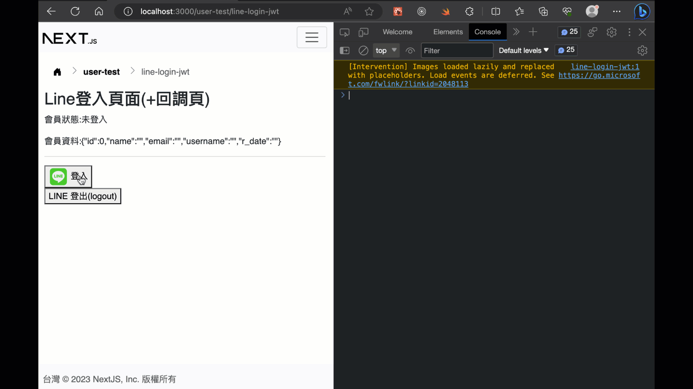

# LINE 登入整合

## 測試畫面



## 預備知識 (!!重要必先了解!!)

1. line登入功能目前在本範例中，只能得到會員名稱和大頭貼圖片，是得不到email的。所以如果你的會員需要用到email，最好你的網站在line登入後，導向這種會員自行再填入email或其它資料。(註: 並不是不加上，而是要從line獲得email，需要另外申請和人工審核。參考[Requesting permission to access the user's email address](https://developers.line.biz/en/docs/line-login/integrate-line-login/#applying-for-email-permission))
2. line登入整合沒有"登出"原本的line的功能(本來就沒有)。目前能作的是要求LINE撤銷通行令牌(revoke access token), 加上登出自己的網站。([revoke access token](https://developers.line.biz/en/docs/line-login/managing-users/#logout))
3. line登入整合沒有彈跳視窗的登入流程(本來就沒有)。
4. line的登入後的存取通行令牌(access token)的設計，有很長的存活期(30天)，和其它的第三方登入的設計不太相同。

## 準備工作 (!!重要必先了解!!)

### 申請 LINE 開發者channel 

1. 申請網址: [https://developers.line.biz/en/](https://developers.line.biz/en/)
2. 請用 "LINE 帳號" 登入申請，不要用商用帳號的email另外申請。(不然你無法用手機測試登入，就算加入到測試帳號，如果不是line的帳號似乎無法測試)。因為是測試中的channel id，也只有這個申請的LINE帳號能登入而已。

申請步驟影片: 

[https://youtu.be/7sOIStKkIZk](https://youtu.be/7sOIStKkIZk)

### 伺服器端-資料庫

會員資料表(例如`users`)新增兩個欄位`line_uid`與`line_access_token`:

> 註: `line_access_token`是為了要記錄line給的access token(存取通行令牌)，目前是為了登出機制用。

```sql
ALTER TABLE users
ADD COLUMN line_uid VARCHAR(200) COMMENT '';

ALTER TABLE users
ADD COLUMN line_access_token TEXT COMMENT '';
```

### 伺服器端-環境變數

> 註: 可以參考專案中`.env.local`的範例(以下範例你需要改為自己申請的channel id和secret。注意: 不作其它設定時，預設只有這個申請的LINE開發者帳號能登入)

> 檔案: `.env`

```text
# line login 
# 注意: LINE_LOGIN_CALLBACK_URL 是前端(react/next)路由
# 必需要與 LINE developer 的 "Callback URL" 設定一致
LINE_CHANNEL_ID=2000376888
LINE_CHANNEL_SECRET=ea6f6a568cf9851292c184e0c9f4abca
LINE_LOGIN_CALLBACK_URL=http://localhost:3000/user-test/line-login-jwt
```

### 伺服器端-套件

1。安裝所需套件:

```sh
npm i bluebird secure-compare request debug
```

2。複製`services/line-login.js`到你的專案中，一樣建立`services`資料夾在專案裡。

> 註: 上面這套件是從這個模組專案複製稍微改寫來的: [line-login](https://github.com/nkjm/line-login)，目前是可以正常使用，但它可能需要再進一步改寫來去除多餘的舊套件。它對應的版本是[LINE Login v2.1 API](https://developers.line.biz/en/reference/line-login/)。

## 程式碼解說

### 伺服器 - 登入

> login路由: `routes/line-login.js`

因為透過line給的channel_id與channel_secret，產生登入用的導向連結，所以api的login路由的功能是回傳這個要導向的網址，之後由前台接收後，自己導向瀏覽器視窗到line登入網頁。

這裡透過現成的套件來協助很容易實作:

```js
// 此api路由為產生登入網址，之後前端自己導向line網站進行登入
router.get('/login', LineLogin.authJson())
```

