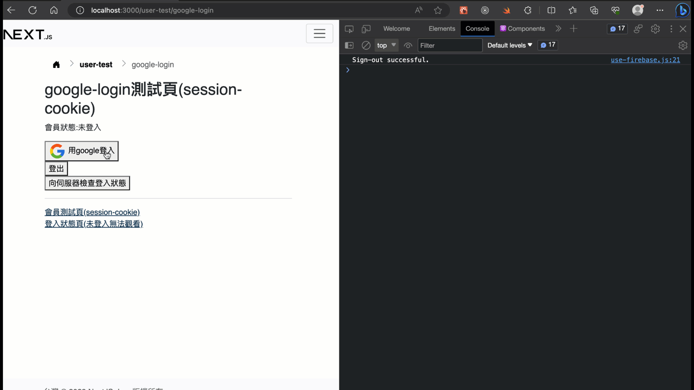

# LINE 登入整合(透過firebase)

## 測試畫面



## 重要說明(必要預先理解)

1. line登入功能目前範例中，只能得到會員名稱和大頭貼圖片，是得不到email的。所以如果你的會員需要用到email，最好你的網站在line登入後，導向這種會員自行再填入email或其它資料。(註: 要獲得email要另外進行申請，需要一個實際要準備運作的網站，再提交一份針對會員的Email線上使用同意書，人工審核後才能得到，參考[Requesting permission to access the user's email address](https://developers.line.biz/en/docs/line-login/integrate-line-login/#applying-for-email-permission))
2. line登入整合沒有"登出"line這種功能(本來就沒有)。目前能作的是要求LINE撤銷通行令牌(revoke access token), 加上登出自己的網站。([revoke access token](https://developers.line.biz/en/docs/line-login/managing-users/#logout))
3. line登入整合沒有彈跳視窗的登入流程(本來就沒有)。

## 準備工作

### 申請LINE channel

### 伺服器端-資料庫

會員資料表(例如`users`)新增一個欄位`line_uid`:

```sql
ALTER TABLE users
ADD COLUMN line_uid VARCHAR(200) COMMENT '';
```

### 伺服器端-環境變數

> 檔案: `.env`

> 註: 可以參考專案中`.env.local`的範例(以下只是範例是不能用的，你需要改為自己申請的channel id和secret)

```text
# line login 
# 注意: LINE_LOGIN_CALLBACK_URL 是前端(react/next)路由
# 必需要與 LINE developer 的 "Callback URL" 設定一致
LINE_CHANNEL_ID=1656281111
LINE_CHANNEL_SECRET=67f71af4602195de2450faeb6f888888
LINE_LOGIN_CALLBACK_URL=http://localhost:3000/user-test/line/callback
```

### 伺服器端-套件

安裝所需套件:

```sh
npm i bluebird secure-compare request debug
```

複製`services/line-login.js`到你的專案中，一樣建立`services`資料夾在專案裡。

> 註: 上面這套件是從這個模組專案複製改寫來的:[line-login](https://github.com/nkjm/line-login)，目前是可以正常使用，但它可能需要再進一步改寫來去除多餘的舊套件。它對應的版本是[LINE Login v2.1 API](https://developers.line.biz/en/reference/line-login/)。

