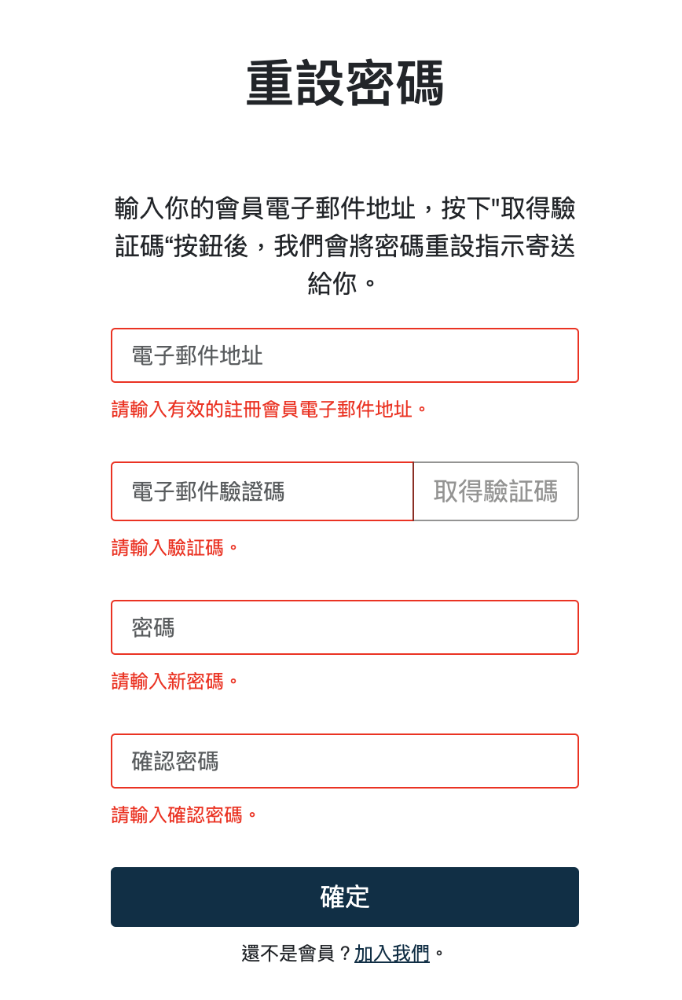
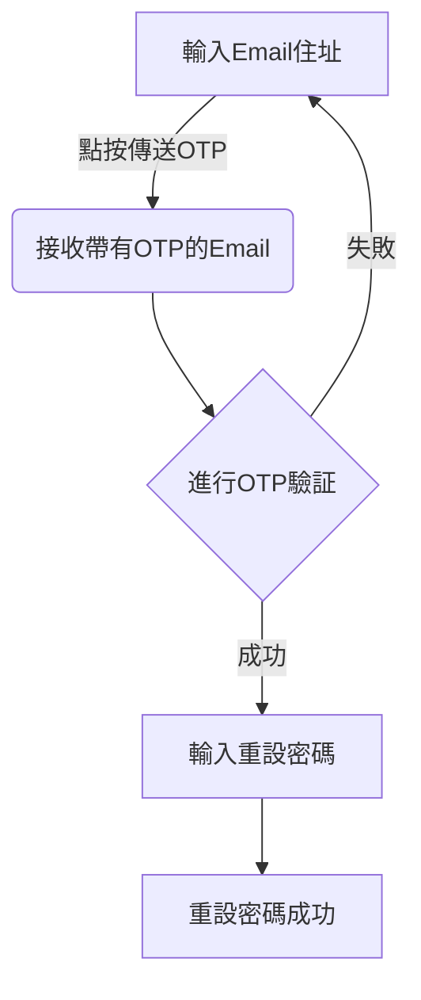
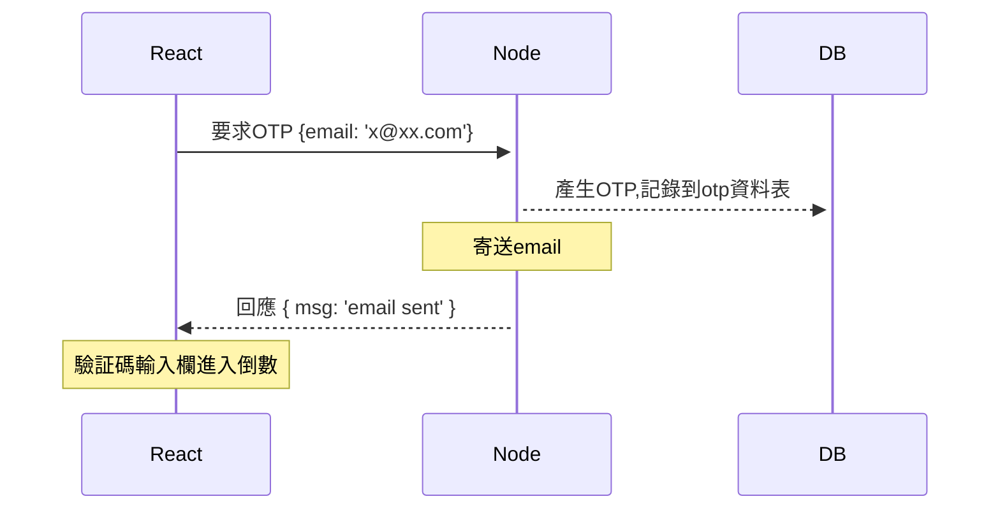
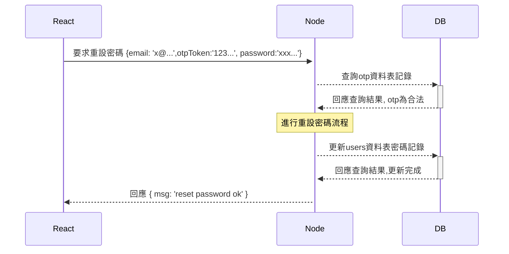

# OTP (one time password)

## 說明事項

- 使用 TOTP 與預設選項(30s step)

## 工作流程(Workflow)

### 說明

1. 使用者在`忘記密碼頁面`，輸入Email後，發送`取得驗証碼`要求
2. 伺服器產生otp後，記錄到資料庫中，寄送otp(6位數字，例如`550093`)到Email中
3. 使用者接收到Email後，將otp填入`電子郵件驗証碼`中，之後設定新密碼，按下確定送到伺服器
4. 伺服器確認資料庫記錄，驗証otp合法性，合法的話就進行資料庫中使用者對應的Email資料的新密碼重新設定

### 示意圖

`忘記密碼頁面`

### 客戶端流程圖

### 時序圖 (Sequence diagram) 

> 註: 以下 React(Next/客戶端/瀏覽器端), Node(伺服器端), DB(資料庫)

#### 要求OTP流程

#### 重設密碼+驗証OTP流程

> 註: 此處的驗証otp流程也可以先獨立驗証，驗証完成再進行重設密碼，但可能需要額外的session機制搭配

