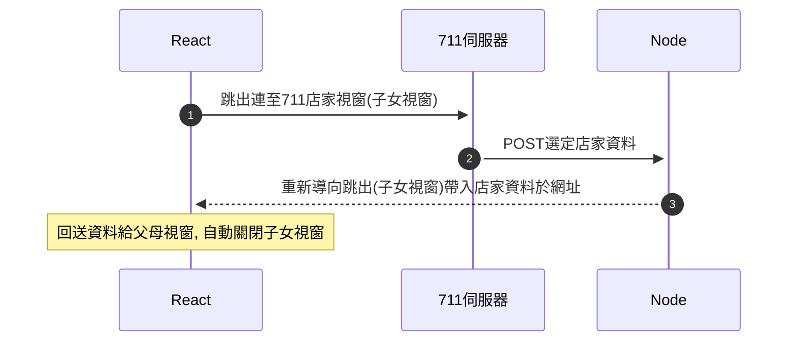

# 7-11 運送商店選擇

## 展示畫面


## 重要說明

!! 請勿用於正式網站，這並不是正式的7-11運送API，只能作為簡單展示。

!! 展示前請再多測試二、三回，連外API以免被阻擋或不穩定or不能用。

!! 手機上目前可能無法使用(註: 經之前測試父母和跳出子女視窗的互動，在手機版瀏覽器中，無法用js來操控)

## 流程

### 時序圖

- 前端瀏覽器: React = Next (或其它JS應用)
- 後端伺服器: Node = Express (或其它伺服器)



## 簡易說明

> 有問題請看程式碼中，或有錯誤訊找程式碼，先能套用就行

### 狀態

> hooks/use-ship-711-store.js

```js
// 記錄店家狀態用
  const [store711, setStore711] = useState({
    storeid: '',
    storename: '',
    storeaddress: '',
    outside: '',
    ship: '',
    TempVar: '',
  })
```

### localStorage使用規則

1. 預設使用`store711`為key
2. 資料類型如store711物件的JSON
3. 寫入時機 - 第三步，由跳出子女視窗更新
4. 讀出時機 - 在父母視窗初次渲染時，如有值則讀出值

關閉(頁面不同步，只作記錄而已，或分兩段進行)，以下參數使用時，會關閉上述第4點的讀出時機點，自行操控也行:

```js
const { store711, openWindow, closeWindow } = useShip711StoreOpener(
    'http://localhost:3005/api/shipment/711',
    { enableLocalStorage :true } 
  )
```

### 預設與使用參數值

`useShip711StoreOpener(serverCallbackUrl, options)`

第一參數為`必要`，沒給會無法跳出使用(!!注意!!)

例如範例中的網址，這網址必需要為Node(express)或伺服器網址才行，這是讓7-11商店選完後，POST資料用的，前端無法作這事情:

```js
'http://localhost:3005/api/shipment/711'
```

第二參數可選為物件值，依需求調整:

```js
{
    title = '7-11運送店家選擇視窗', //跳出視窗標題
    h = 680, //跳出視窗高度
    w = 1209, //跳出視窗寬度
    autoCloseMins = 5, //自動關閉
    enableLocalStorage = true, //是否didMount時要讀取localStorage中資料
    keyLocalStorage = 'store711', // localStorage中的key
  }
```

`useShip711StoreCallback(keyLocalStorage)`

參數預設為`store711`，是localStorage中的key名稱，沒必要不要改。如要修改請與上述勾子中的`keyLocalStorage`同名一起改。

### 後端(伺服器)程式碼

由POST得到值後，加到網址上重導向到前端伺服器而已，實作就一、兩行。

> routes/shipment.js

```js
// 存取`.env`設定檔案使用
import 'dotenv/config.js'

const callback_url = process.env.SHIP_711_STORE_CALLBACK_URL

// POST
router.post('/711', function (req, res, next) {
  //console.log(req.body)
  let searchParams = new URLSearchParams(req.body)
  res.redirect(callback_url + '?' + searchParams.toString())
})
```

## 套用方法

### 相關檔案

前台-工具檔案

- hooks/use-ship-711-store.js
- hooks/use-localstorage.js
- hooks/use-interval.js
- utils/popup-window.js

前台-範例檔案

- pages/ship-test/index.js (測試頁，父母視窗)
- pages/ship-test/callback.js (跳出的子視窗，最後重導向回前端伺服器的網址)

後端

- routes/shipment.js

後端設定檔(.env)

> 請見.env.template檔中的資料，即上面前端那個callback的網址

```text
SHIP_711_STORE_CALLBACK_URL=http://localhost:3000/ship-test/callback
```