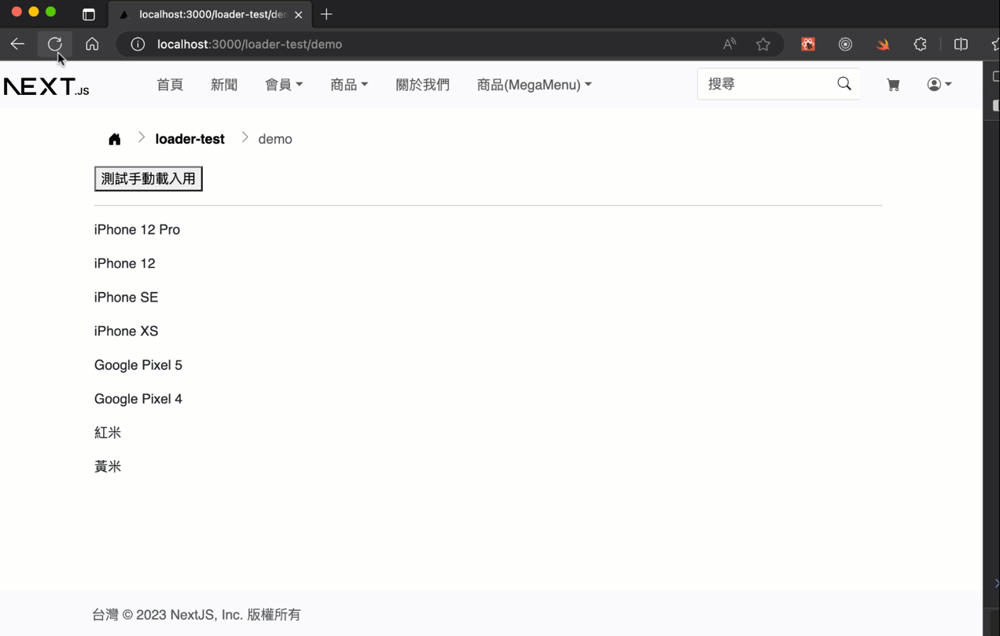

# React(Next)前端全域載入動畫勾子

## 展示



## 說明

- 此勾子與後端無關

## 檔案說明

### 安裝套件

> 註: 不用`lottiefiles`可以略過，預設範例用的是純css動畫

`npm i lottie-react`

### 必要檔案

- `hooks/use-loader`: 資料夾裡面`index.js`是勾子，`components.js`是載入元件範例共有四個，預設是`Loader`這個元件
- `styles/loader.scss`: 所有`Loader`元件的樣式寫在這裡，由`_app.js`導入，因為要減少動態載入css和編譯，用全域css載入為最佳方案
- `assets/`: 裡面的json是由[lottiefiles](https://lottiefiles.com/)下載的動畫json檔案

## 套用說明

### 第 1 步: 全域套用

`use-loader`勾子中有Context，要全域套用，先在`pages/_app.js`中像其它Context一樣套入:

```js
// 載入動畫context
import { LoaderProvider } from '@/hooks/use-loader'
// 自訂用載入動畫元件
import { NikeLoader } from '@/hooks/use-loader/components'
// ...

export default function MyApp({ Component, pageProps }) {
  // ...
  return (
    <LoaderProvider close={3} CustomLoader={NikeLoader}>
       {getLayout(<Component {...pageProps} />)}
    </LoaderProvider>
  )
}
```

- `close={3}` 3秒自動關閉的設定
- `CustomLoader={NikeLoader}` 套入自訂元件，參考`hooks/use-loader/components.js`中的`NikeLoader`元件寫法，需要有`show`控制呈現與關閉這個屬性(props)值才行，其它按需求套用

```jsx
<LoaderProvider close={3} CustomLoader={NikeLoader}>
```

> `NikeLoader`元件

```jsx
import Lottie from 'lottie-react'
import nikeAnimation from '@/assets/loader-nike.json'

// lottie-react
export function NikeLoader({ show = false }) {
  return (
    <div className={`nike-loader-bg ${show ? '' : 'nike-loader--hide'}`}>
      <Lottie
        className={`nike-loader ${show ? '' : 'nike-loader--hide'}`}
        animationData={nikeAnimation}
      />
    </div>
  )
}
```

### 第 2 步: 放置載入動畫位置

在版面檔案中，導入`useLoader`勾子後，加入到渲染位置，例如範例中的`components/layout/default-layout/index.js`。

> !! 注意是用`{loader()}`，`loader`是個函式，呼叫執行後才會回傳元件。

```js
import { useLoader } from '@/hooks/use-loader'
// ...
export default function DefaultLayout({ title = '', children }) {
  // 全域的載入動畫指示器
  const { loader } = useLoader()

  return (
    <>
      <Head>
        <title>{title}</title>
        <meta name="viewport" content="width=device-width" />
      </Head>
      <MyNavbarBS5 />
      <main className="flex-shrink-0 mt-3">
        <div className="container">
          <NextBreadCrumb isHomeIcon isChevron bgClass="" />
          {children}
        </div>
        {/* 全域的載入動畫指示器 */}
        {loader()}
      </main>
      <MyFooter />
    </>
  )
}
```

### 第 3 步: 載入資料時呈現載入指示層動畫

見`pages/loader-test/demo.js`程式碼。

主要由`showLoader`函式呼叫後呈現，由`loading`值可知道目前正在載入中。

!!! 進階使用，沒需要時，先不要用`hideLoader`與`delay`是用於手動控制關閉，進階使用，如果資料需要客製載入時間，或是作錯誤處理時，再使用即可，要進階使用前先用範例測試看看。

---

## 其它

### 響應式設計

請用Loader對應的css media queries調整位置與大小即可。

這是半透明的背景圖層，是滿版全網站簡單範例，手機版應該也不需要改它:

```css
.nike-loader-bg {
  content: '';
  width: 100%;
  position: fixed;
  left: 0;
  right: 0;
  top: 0;
  bottom: 0;
  /* margin-bottom: 40px; */
  /* margin-top: 56px; */
  background-color: rgba(173, 181, 184, 0.8);
  z-index: 9999;
}
```

這是動畫圖出現的位置，`width, height`可以控制大小，`top, left`和位置有關，微調一下差不多到正中間就行了，手機版應該要小一點，用media queries調小和位置調一下應該就行了:

```css
// 以下 top, left, width, height需要調整位置到差不多中間
.nike-loader {
  position: absolute;
  top: calc(50% - 4em);
  left: calc(50% - 7.5em);
  width: auto;
  height: 8em;
  font-weight: bold;
  display: inline-block;
}

// 手機用大小和位置
@media screen and (max-device-width: 480px) {
  .nike-loader {
    top: calc(50% - 2.5em);
    left: calc(50% - 4em);
    width: auto;
    height: 5em;
  }
}
```